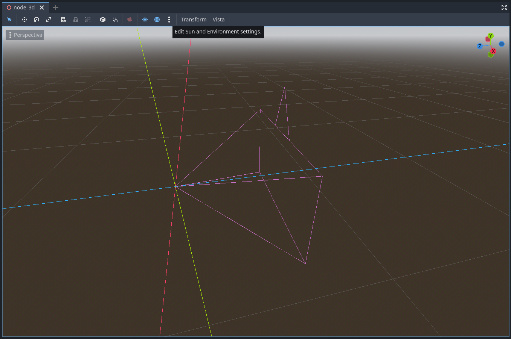

# EN ESTE PROYECTO

## Inicio

- Creamos un Nodo3D con una cámara 🎥 3D dentro.

En la parte superior del programa podemos observar tres puntos en disposición vertical.

<!-- 

 -->

<!--  -->

Al hacer clic sobre ellos se pliega un menú, el cual posee en su esquina inferior izquierda un botón que dice `Add Sun To Scene`, con el cual agregamos un sol .
Hacemos clic en él.

<!--  -->

Volvemos a hacer clic sobre los puntos y clic en el botón que dice:

> ` Add environment To Scene` agregando un ambiente.

Con esto ya podemos reproducir nuestra escena en el panel de la esquina superior derecha .
O con la tecla F6. Le ponemos un nombre a la escena y la guardamos.

<!--  -->

## Mesh instance 3D

En la escena principal agregamos un nuevo nodo.
Este nodo lo podemos agregar haciendo clic en el icono `+` que se encuentra hacia
la izquierda superior de nuestra pantalla.
En el buscador del menú que nos aparece escribimos `meshin` y se nos da a elegir
algunos tipos de nodo. Seleccionamos `MeshInstance3D` y damos crear. Ahora
podemos verlo dentro de la jerarquía de nuestra escena.

Hacia la derecha de nuestra pantalla nos encontramos con el inspector, que como
tiene seleccionado nuestro nodo `MeshInstance3D`, nos muestra sus propiedades.
Hacemos clic en `<empty>` y agregamos un `Nuevo PlaneMesh`.

<!--  -->

En el inspector podemos observar la propiedad size a la cual le cambiamos el
valor a x:10m e y:10m.

> - Nótese que si volvemos a reproducir la escena, el plano todavía no se ve.
>   Esto se debe a que la malla y la cámara se encuentran sobre la misma línea del
>   horizonte.

Seleccionamos la cámara (en la pantalla podemos observar un icono rojo con
forma de cámara si hacemos clic en él podemos obtener una vista rápida de la
cámara).

Una vez seleccionada la cámara, veamos el inspector. En la barra de navegación vamos a nodo 3
ingresamos a su transform y cambiamos el valor del eje y de `0.65` a `2` y
reproducimos nuevamente la escena con `F6`.

## CONFIGURACIÓN GRÁFICA

En la esquina superior izquierda de la pantalla hacemos clic en `Proyecto`
y luego en `ajustes del proyecto`. En la pestaña `general` vamos a `display` y a
`Windows`. Dentro en `Size` ajustamos los valores de `Viewport Height en 1920 `
y los de `Viewport Width en 1080` luego en `Modo` colocamos `Maximized`.

Una vez hecho esto, en la columna de la izquierda de la pestaña `general`,
localizamos Rendering y hacemos clic en Anti Aliasing. En `Quality MSAA 3D`
colocamos la opción de `2x (Average)`. Luego hacemos clic en `Advanced Settings`.
Nuevamente en el panel de la izquierda buscamos, en este caso, `Lights and Shadows`,
hacemos clic, buscamos `Directional Shadows` y `Soft Shadows Filter` y colocamos la
opción de `Soft Medium (Average)`.

### CREACIÓN DEL PERSONAJE
